<a href="https://www.gatsbyjs.com">
  
</a>

# Gatsby Starter Drupal Homepage

Create a homepage using Gatsby and Drupal. This starter demonstrates how to use Drupal to build a homepage and can be customized to match your own visual branding.

[View the Demo](https://gatsbydrupalhomepage.gatsbyjs.io/)

**Note:**
This version of the Drupal homepage starter is written in JavaScript. If you want to use Drupal but TypeScript is more your style, there is also a TypeScript version maintained on [GitHub](https://github.com/gatsbyjs/gatsby-starter-drupal-homepage-ts).

## Quick start

You will need a new or existing `Drupal` website to use this starter and will be asked for your `baseUrl` and the `username` and `password` for your `Drupal` during installation.

1. **Create a Gatsby site**

   Use the Gatsby CLI to get started locally:

   ```sh repo
   npx gatsby new my-homepage https://github.com/gatsbyjs/gatsby-starter-drupal-homepage
   ```

1. **Import content to your Drupal instance**

   For this implementation we used **Pantheon** as our host. So some configurations may be specific to that platform. Before importing the sql dump file we recommend extracting and adding the files located in **`data/files.zip`** to your drupal site under **`sites/default/`** or wherever your files folder is located on your instance. Afterwards you may use the **sql** dump file provided in the same **data** directory called **`homepage-starter-dump.sql.gz`**. Depending on the setup, you may have to extract the sql file before trying to import the data.

   ## Hosting on Pantheon

   1. Go to Pantheon.io, register and log in

   1. Create a new blank project and provide a name for the project

      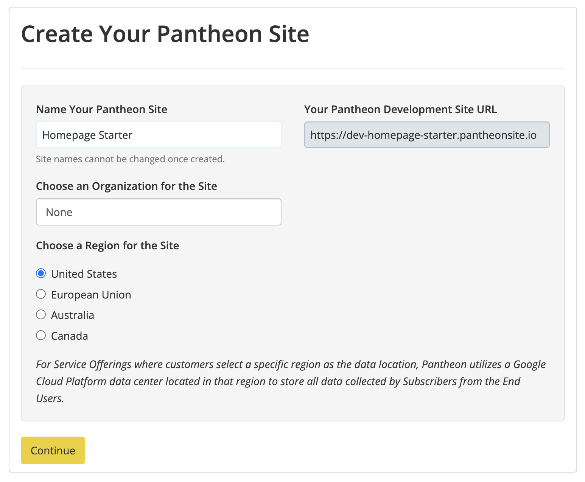

   1. Select Drupal with Composer and then following the instructions to complete the installation

      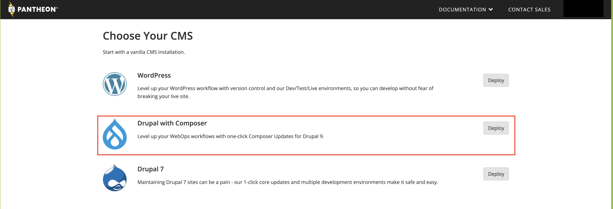

   1. On the **Dashboard** there will be three (3) environments (_Dev, Test and Live_) and for our purposes we will use **Dev**. Select _Database/Files_ then _Wipe_. Click **_Wipe the Development Environment_** and follow the instructions to start with an empty site.

      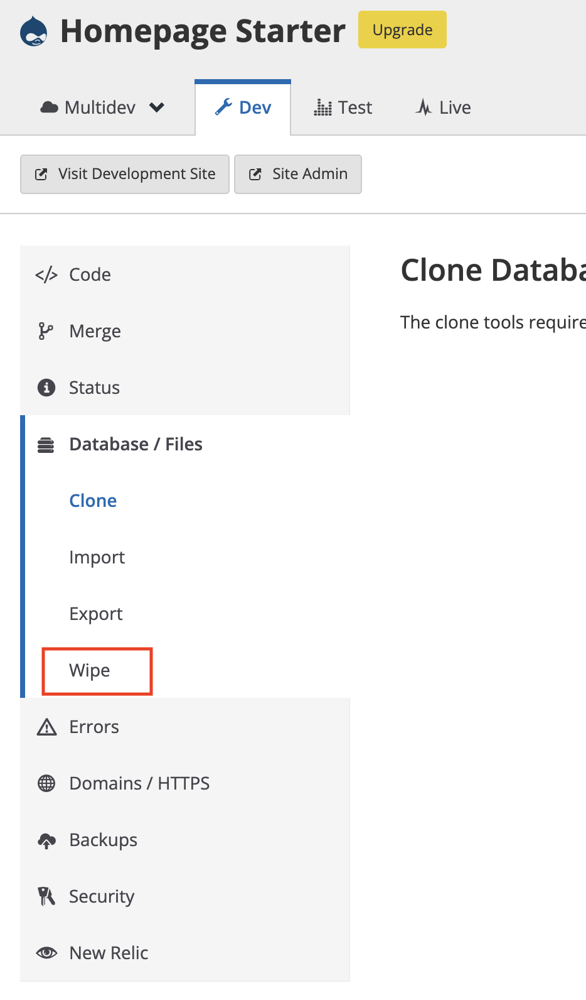

   1. Go to _Import_. Here under **MySQL Database** select **File** and use the **homepage-starter-dump.sql.gz** provided in the data directory to upload the database. Make sure _Run update.php after the database import finishes_ is selected before uploading the file. Click **_Import_**.

      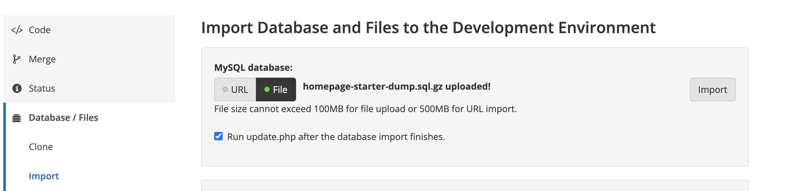

   1. Under **Archive of site files** select **File** and use the **files.zip** also provided in the data directory to upload the files. Click **_Import_**.

      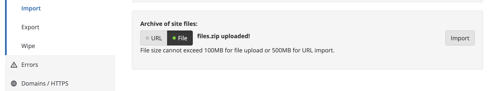

   1. **_Clear Caches_** and test out your site by clicking either **_Visit Development Site_** or **_Site Admin_**.

      

   1. The credentials for logging in are:
      `sh username: admin password: DrupalGatsby123`
      It is highly recommended that you change the password to your Drupal site afterwards to something that only you know.

      Now, our site is up but we still need to install the [Gatsby Module](https://www.drupal.org/project/gatsby). To do that on **Pantheon** we need to pull down the site locally and install the module using **composer**. To streamline this process we will use a free, open source, cross-platform tool called [Lando](https://lando.dev/) which you can [Download Here](https://github.com/lando/lando/releases/tag/v3.6.0) (At the time v3.6.0 was the latest stable version).

### Lando & Pantheon Integration

For a video guided step-by-step tutorial see the links below:

[Local dev for Pantheon sites with Lando by Jantcu](https://www.youtube.com/watch?v=88WUuV-WJao)

1. Install **Lando** and **Docker**

1. A **Machine Token** is needed by **Pantheon** in order to _push and pull_ the **Database, Files and Code**. To generate a **Machine Token** follow these [instructions](https://pantheon.io/docs/machine-tokens). Remember that the **Machine Key** will only be visible once so keep it handy.

1. ```sh
   # Create a new directory for your Drupal site
   mkdir homepage-starter
   cd homepage-starter

   # Initialize Lando and when prompted select Pantheon and paste in the Machine Key generated earlier. Continue following the prompts provided to pull donw your site.
   lando init

   # Start server
   lando start

   # Pull down Database, Files and Code. We are working on the dev server so be sure to select "dev" when prompted
   lando pull

   # Clear caches
   lando drush cr
   ```

1. ```sh
   # Manually install modules
   lando composer config repositories.2 '{"type": "package", "package": { "name": "ionaru/easy-markdown-editor", "version": "2.15.0", "type": "drupal-library", "dist": { "url": "https://registry.npmjs.org/easymde/-/easymde-2.15.0.tgz", "type": "tar" } } }'
   lando composer require 'drupal/gatsby:^1.0@RC'
   lando composer require 'drupal/markdown:^3.0@RC'
   lando composer require 'league/commonmark:^1.0'
   lando composer require 'drupal/simplemde:^1.0@alpha'

   # Optional but makes navigation easier
   lando composer require 'drupal/admin_toolbar'

   # Clear caches again
   lando drush cr

   # Push up Database, Files and Code. We are working on the dev server so be sure to select "dev" when prompted
   lando push
   ```

All the modules should now be installed and activated. To ensure that they are all installed correctly:

1. Go to your local **Drupal** site and login.

1. Select _Extend_ in the toolbar.

   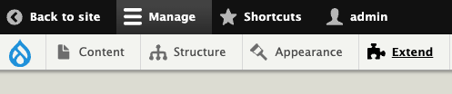

1. Find the **Gatsby Section** and check **_Gatsby_**, **_Gatsby Fast Builds_**, **_Gatsby JSON\:API Instant Preview and Incremental Builds_**. All other dependent modules will automatically be installed.

   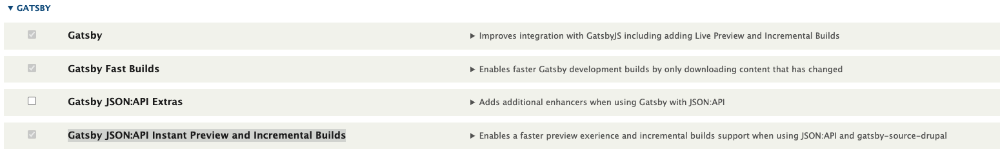

1. Find the **Web Services Section** and ensure that **_HTTP Basic Authentication_** is checked.

   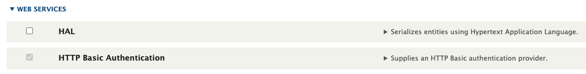

1. Head to the bottom on the page and click the **Install** button.

1. Now you're done in your Drupal site! But we have one more step remaining to connect to your Gatsby homepage site.

1. **Run the setup script**

After setting up the Drupal site, navigate back to your Gatsby site's root directory and run:

```sh
yarn setup
```

This will run a script to create `.env.development` and `.env.production` files for you populated with your Drupal site environment variables.

---

## Local Drupal Development

The **composer.json** file as well as exported configurations found in the **config** folder are also included. If you decide to import and install these configurations, please do so before executing the **sql** script and be sure **not** to clean the existing database.

```sh
# import configurations
drush cim

# initial install
composer update

# installing from composer.lock
composer install
```

### Drush

For more information on how to use drush commands and how to install the command line shell visit [Drush Documentation Site](https://www.drush.org/latest/).

```sh
# If you wish to start from a clean site
drush sql-drop
drush sql-cli < ~/path/to/homepage-starter-dump.sql
```

An **admin** user already exists in the application. You will have to reset the password if you decide to start from a clean site.

```sh
# Drush 9
drush user:password admin "new_password"

# Drush 8 & earlier
drush user-password admin --password="new_password"
```

### Lando

A free, open source, cross-platform, local development environment and DevOps tool built on Docker container technology and developed by Tandem. [See the docs](https://docs.lando.dev/).

```sh
# This will destroy the database and import the data.
# If you wish to keep you existing data add the --no-wipe flag.
lando db-import ~/path/to/homepage-starter-dump.sql
```

1. **Start developing**

   In your site directory, start the development server:

   ```sh
   yarn start
   ```

   Your site should now be running at <http://localhost:8000>

1. **Open the source code and start editing**

## Deploy your site

Once your content is available in Drupal, deploy your site to [Gatsby Cloud](https://gatsbyjs.com/products/cloud):

1. Push your local site to a new repo in either GitHub, GitLab, or Bitbucket
1. Log into your [Gatsby Cloud Dashboard][] and click on **Add a site**
1. Use the **Import from a Git repository** option to find your site
1. Add the environment variables from your `.env.production` file to Gatsby Cloud during setup
1. Click **Build site** and your site should start building

For a more detailed walkthrough, see the tutorial on how to [build your site with Gatsby Cloud][tutorial].

[gatsby cloud dashboard]: https://gatsbyjs.com/dashboard
[tutorial]: https://www.gatsbyjs.com/docs/tutorial/part-1/#build-your-site-with-gatsby-cloud

### Deploy without using the CLI

Alternatively, you can deploy this starter directly to Gatsby Cloud.

Note that you will need to set up your content in Drupal manually.

[](https://www.gatsbyjs.com/dashboard/deploynow?url=https://github.com/gatsbyjs/gatsby-starter-drupal-homepage)

## Setting up Gatsby Cloud Preview

To enable Gatsby Preview with this site, see the documentation for:

[Configuring for Live Preview](https://www.gatsbyjs.com/docs/how-to/sourcing-data/sourcing-from-drupal/#configuring-gatsby-live-preview)

[Installing Gatsby Module for Drupal](https://www.drupal.org/project/gatsby)

[Drupal FastBuilds](https://support.gatsbyjs.com/hc/en-us/articles/1500008011822-Drupal-Fastbuilds-with-Gatsby-Cloud)

## What's included?

```sh
├── README.md
├── gatsby-config.js
├── gatsby-node.js
├── src
│   ├── components
│   ├── pages
│   ├── colors.css.ts
│   ├── styles.css.ts
│   └── theme.css.ts
└── .env.EXAMPLE
```

1. **`gatsby-config.js`**: [Gatsby config][] file that includes plugins required for this starter.
1. **`gatsby-node.js`**: [Gatsby Node][] config file that creates an abstract data model for the homepage content.
1. **`src/`**: The source directory for the starter, including pages, components, and [Vanilla Extract][] files for styling.

[gatsby config]: https://www.gatsbyjs.com/docs/reference/config-files/gatsby-config/
[gatsby node]: https://www.gatsbyjs.com/docs/reference/config-files/gatsby-node/
[vanilla extract]: https://vanilla-extract.style/

## How to

### Update the color theme

To update the colors used in this starter, edit the `src/colors.css.ts` file.

```.ts
// src/colors.css.ts
export const colors = {
  background: "#eff6ff",
  text: "#004ca3",
  primary: "#004ca3",
  muted: "#e6f1ff",
  active: "#001d3d",
  black: "#000",
}

```

If you'd like to add additional colors, add additional keys to this object.
This file is imported into `src/theme.css.ts` and creates CSS custom properties, that can be imported and used in other `.css.ts` files.

The UI components file `src/components/ui.js` imports styles from `src/components/ui.css.ts`. You can see how the theme and color values are being used in this file.

### Add your logo


Replace the `src/components/brand-logo.js` component with your own brand logo.
If you have an SVG version, it can be rendered inline as a React component, following the example in this file. Note that SVG attributes will need to be camel cased for JSX.

Using an inline SVG for the logo allows it to pick up the colors used in CSS, which is how the logo colors are inverted for the mobile menu.

If you prefer to use an image, use the [`StaticImage`](https://www.gatsbyjs.com/docs/reference/built-in-components/gatsby-plugin-image/#staticimage) component from `gatsby-plugin-image` in place of the SVG in this file.

### Customize headings, buttons, and other styles

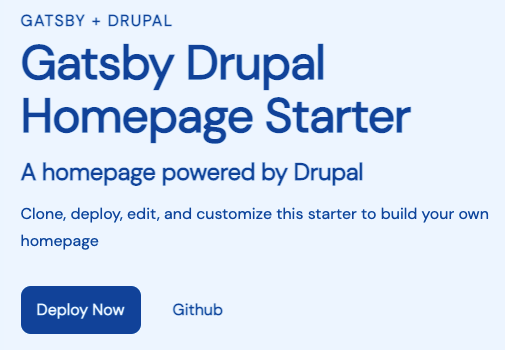

To further customize the look and feel of the homepage, edit the UI components in `src/components/ui.js` and styles in `src/components/ui.css.ts`.

### Customize section components

To customize any of the sections of the homepage, edit the relevant component in `src/components`.
Most of the styles for these components are handled with shared UI components in `src/components/ui.js`.

### Create custom section components

To create a new type of section in your homepage, you'll want to create a new section component, using the existing components as an example.
For this example, we'll create a new "Banner" component.

1. First, update your content model in Drupal

   1. In your Drupal website, create a new content type and call it "Homepage Banner".

      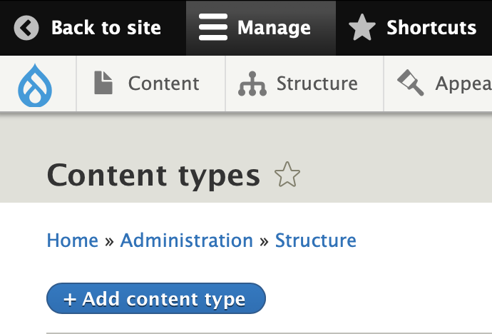

   1. For this example, change the _Title_ field's name to _Heading_ in when creating your new content type. Remove any fields that are added dy default and create a new field called `text` this should be of `Text (plain, long)` data type or use an existing field with the same type and field name.

      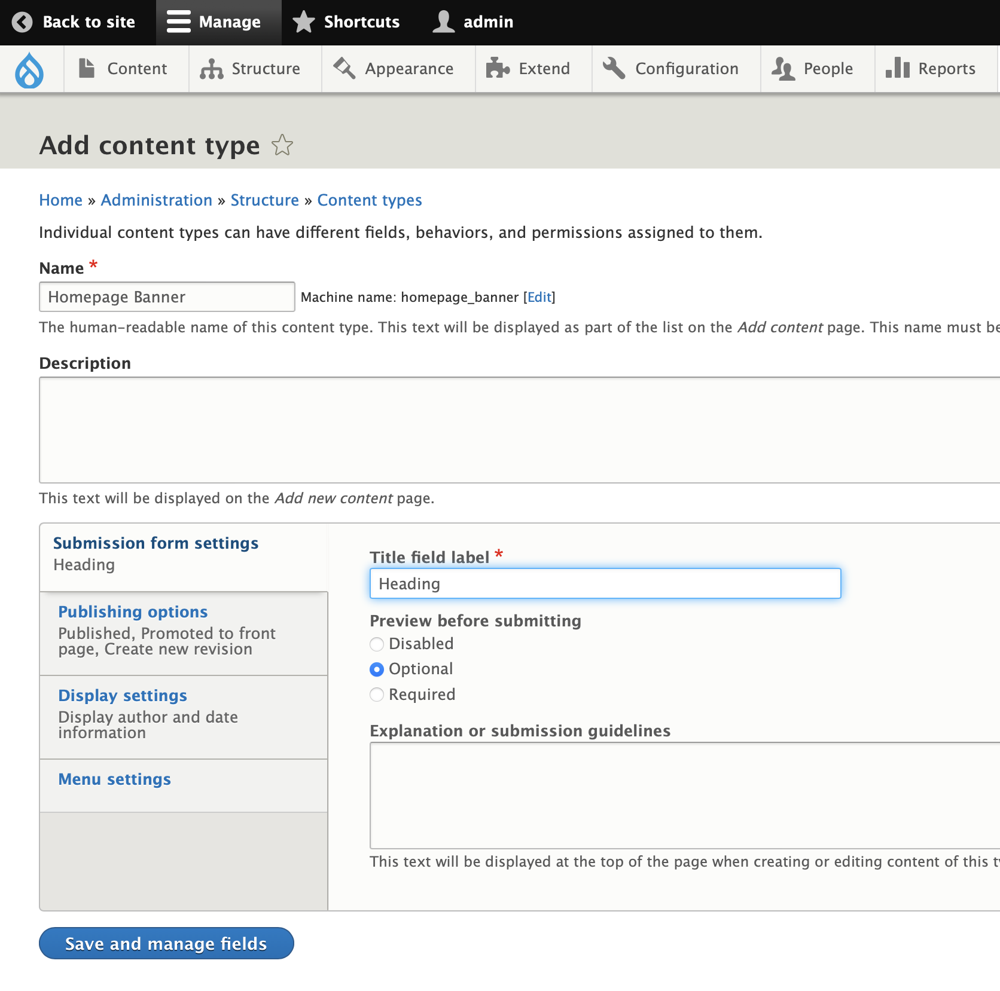

      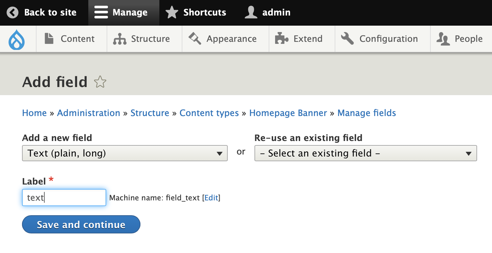

   1. Find the content type for `Homepage` click _Manage fields_ and edit the settings for the `content` field. Under _Reference Type -> Content Type_, ensure that the new `Homepage Banner` type is checked to make it available as a content type on the Homepage.

      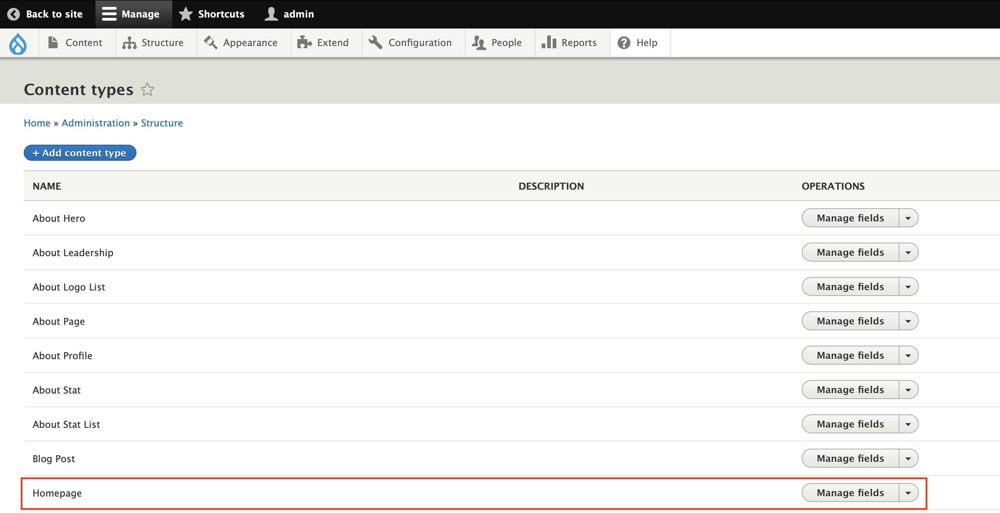

      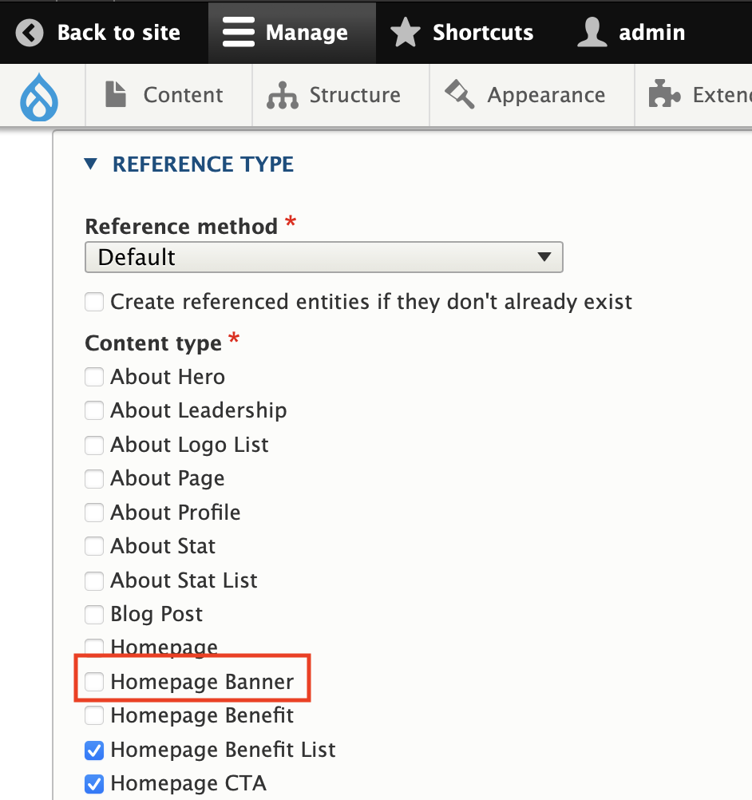

   1. Create a new `Homepage Banner` entry then navigate back to the `Content` page to edit the `Homepage` entry and insert a section with this new `Homepage Banner` by appending it to the list.

      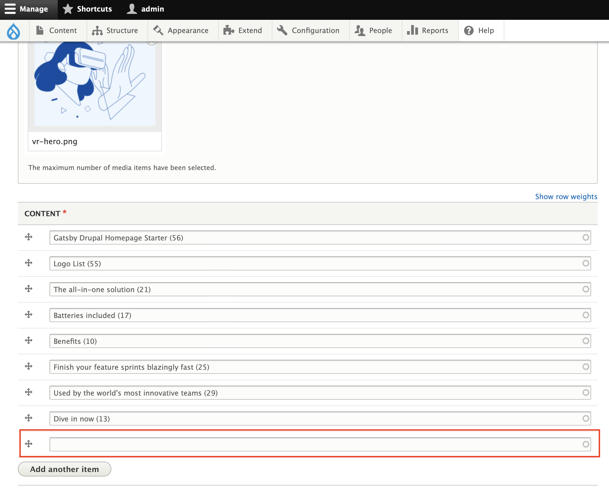

1. Update `gatsby-node.js`

   Edit your site's `gatsby-node.js` file, adding an interface for `HomepageBanner` that matches your content model in Drupal.
   This allows the homepage to query the abstract `HomepageBanner` type.

   ```js
   // in gatsby-node.js
   exports.createSchemaCustomization = async ({ actions }) => {
     // ...
     actions.createTypes(`
       interface HomepageBanner implements Node & HomepageBlock {
         id: ID!
         blocktype: String
         heading: String
         text: String
       }
     `)
     // ...
     actions.createTypes(`
       type node__homepage_banner implements Node & HomepageBanner & HomepageBlock @dontInfer {
         id: ID!
         blocktype: String @blocktype
         heading: String
         text: String
       }
     `)
     // ...
   }
   ```

1. Next, create the Banner component:

   ```jsx fileExt
   // src/components/banner.js
   import * as React from "react"
   import { graphql } from "gatsby"
   import { Section, Container, Heading, Text } from "./ui"

   export default function Banner(props) {
     return (
       <Section>
         <Container>
           <Heading>{props.heading}</Heading>
           <Text>{props.text}</Text>
         </Container>
       </Section>
     )
   }

   export const query = graphql`
     fragment HomepageBannerContent on HomepageBanner {
       id
       heading
       text
     }
   `
   ```

1. Export the component from `src/components/sections.js`

   ```js fileExt
   // src/components/sections.js
   export { default as HomepageHero } from "./hero"
   export { default as HomepageFeature } from "./feature"
   export { default as HomepageFeatureList } from "./feature-list"
   export { default as HomepageLogoList } from "./logo-list"
   export { default as HomepageBenefitList } from "./benefit-list"
   export { default as HomepageTestimonialList } from "./testimonial-list"
   export { default as HomepageStatList } from "./stat-list"
   export { default as HomepageCta } from "./cta"
   export { default as HomepageProductList } from "./product-list"

   // add export for new component
   export { default as HomepageBanner } from "./banner"
   ```

1. Add the GraphQL query fragment to the query in `src/pages/index.js`

   ```js fileExt
   // in src/pages/index.js
   export const query = graphql`
     {
       homepage {
         id
         title
         description
         image {
           id
           url
         }
         blocks: content {
           id
           blocktype
           ...HomepageHeroContent
           ...HomepageFeatureContent
           ...HomepageFeatureListContent
           ...HomepageCtaContent
           ...HomepageLogoListContent
           ...HomepageTestimonialListContent
           ...HomepageBenefitListContent
           ...HomepageStatListContent
           ...HomepageProductListContent
           # New component fragment
           ...HomepageBannerContent
         }
       }
     }
   `
   ```

## Troubleshooting

### Errors after making changes to the schema

If you've made changes to the `gatsby-node.js` file or changes to the Drupal data model, clear the Gatsby cache before running the develop server:

```sh
yarn clean && yarn start
```

---

## 🎓 Learning Gatsby

Looking for more guidance? Full documentation for Gatsby lives [on the website](https://www.gatsbyjs.com/). Here are some places to start:

- **For most developers, we recommend starting with our [in-depth tutorial for creating a site with Gatsby](https://www.gatsbyjs.com/tutorial/).** It starts with zero assumptions about your level of ability and walks through every step of the process.
- **To dive straight into code samples, head [to our documentation](https://www.gatsbyjs.com/docs/).**

## 💫 Deploy

[Build, Deploy, and Host On The Only Cloud Built For Gatsby](https://www.gatsbyjs.com/cloud/)

Gatsby Cloud is an end-to-end cloud platform specifically built for the Gatsby framework that combines a modern developer experience with an optimized, global edge network.
